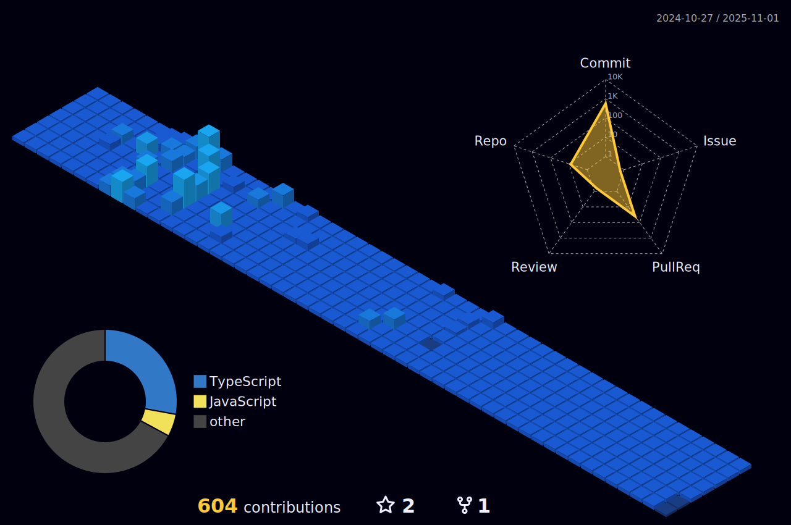

## 안녕하세요, 프론트엔드 [이숙영](https://github.com/22sook00/) 입니다.

### Work & Experience

- 🖌️ &nbsp; 웹툰서비스 <b>미스터블루</b> 프론트 팀 (2025.02~)  
- 🚀 &nbsp; 노코드 웹빌더 <b>스퀘어스</b> 커머스 팀 (2022.09~2024.11)
- 🛠 &nbsp; 외국인 주거 플랫폼 <b>엔코위더스 근무</b> (2021-2022)
- 👾 &nbsp; 코드스테이츠 39기-45기 프로젝트 멘토참여 (2022-2023)
- 📫 &nbsp; 22sook00@gmail.com

### Favorites

- 🎨 &nbsp; 예쁘고(UI) 편리한것(UX)을 좋아합니다. 
- 💻 &nbsp; 효율적인 개발자 경험(DX) 을 위한 공부를 합니다.
- 🍕 &nbsp; 네트워킹 / 테크스터디 참여를 좋아합니다.
- 🏃🏻‍♀️ &nbsp; 오랜 개발생활 유지를 위해 체력을 기르고 있습니다.

### Languages and Tools

  	<code></code>
	<code></code>
	 	<code></code>
  <code></code>  
<code></code>
  	<code></code>
  	<code></code>
  	<code></code>
  	<code></code>
  <code></code>
  <code></code>
	<code></code>
	<code></code>
	<code></code>

### Github Stats

    
